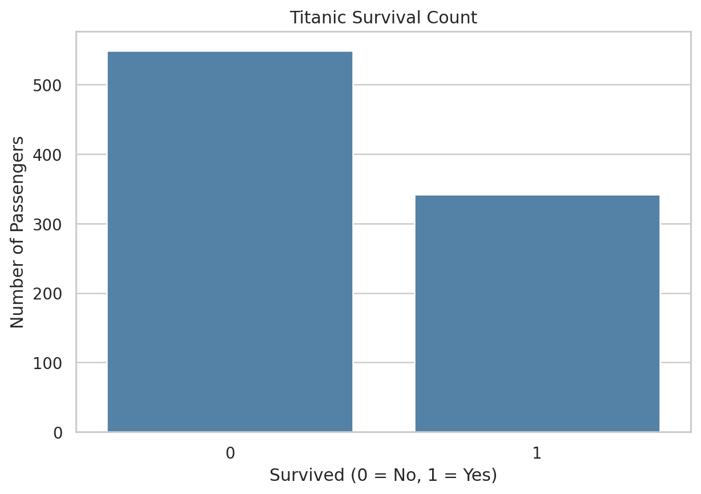
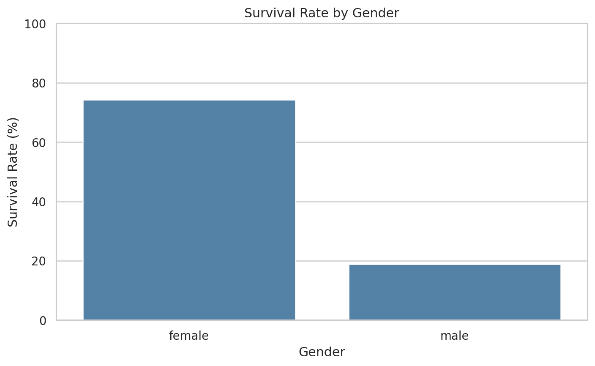
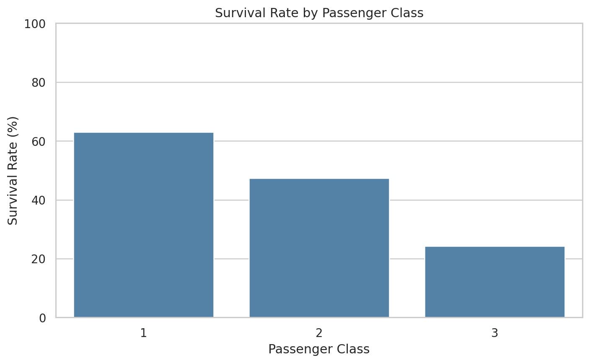
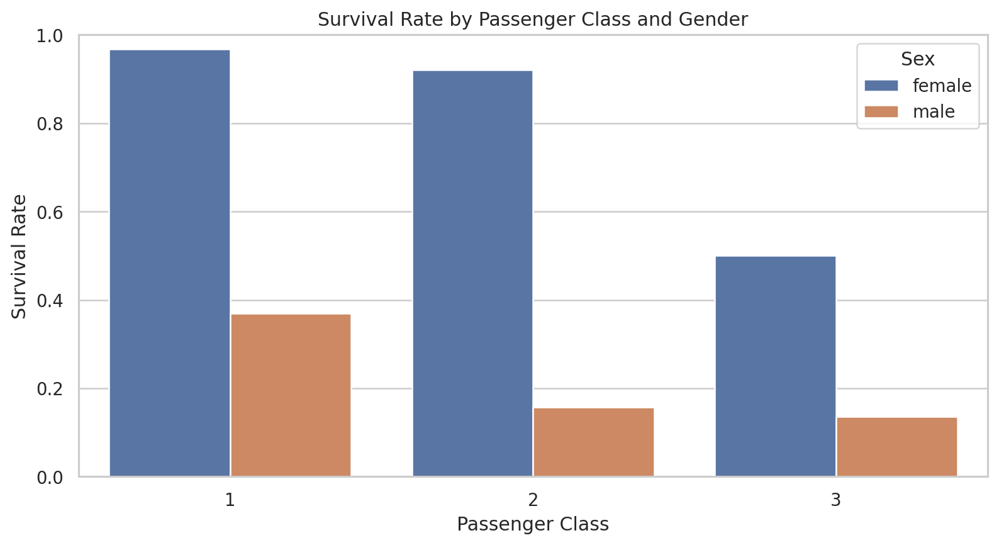
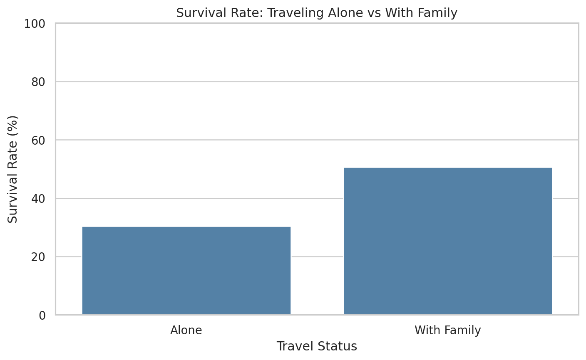
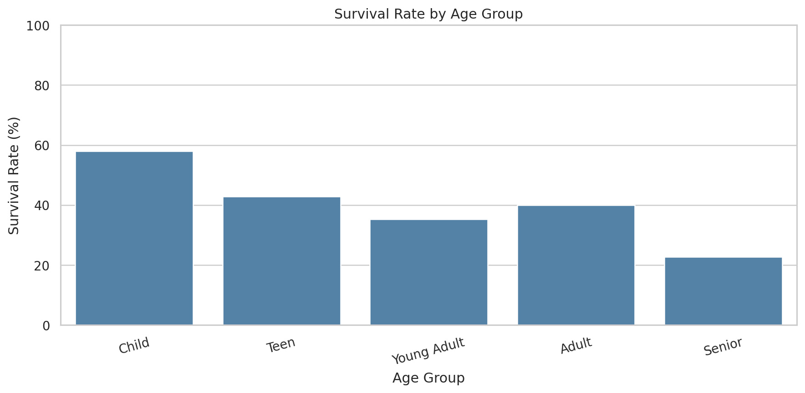
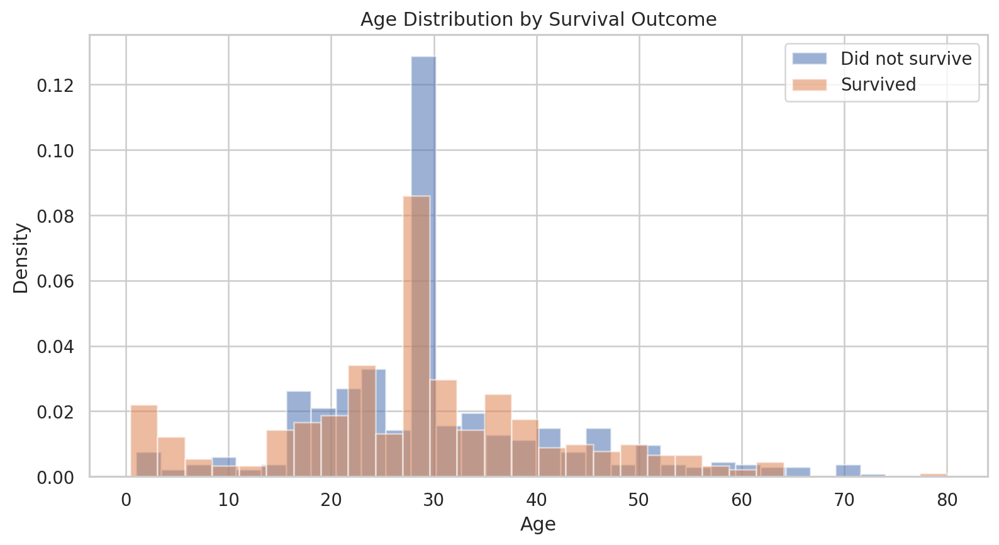
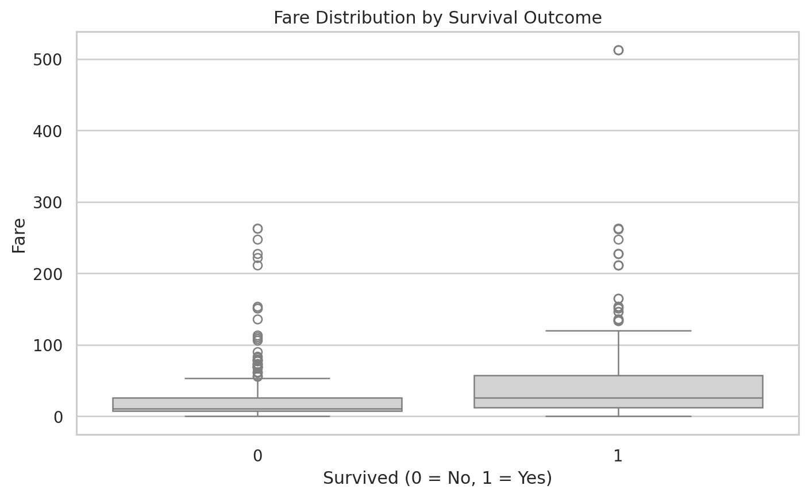
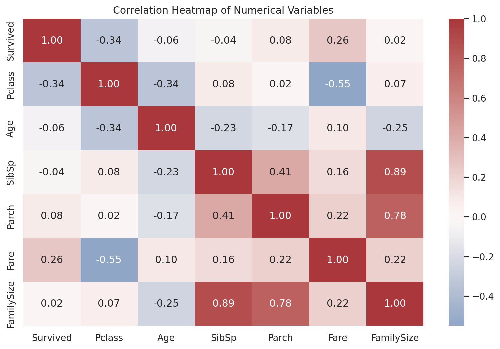

# Data Science Mini Project — Titanic Passenger Survival Analysis

This repository contains a complete beginner-friendly data science mini project for internship submission. The project analyzes the **Titanic passenger dataset** to discover patterns associated with passenger survival.

## Project Objective

- Load and understand a real-world dataset.
- Clean missing and inconsistent data.
- Create useful derived features.
- Perform exploratory data analysis (EDA).
- Build clear visualizations.
- Summarize meaningful findings in a Jupyter Notebook.

## Dataset

The included CSV contains **891 passenger records and 12 columns**. The outcome column is `Survived` where `0` means did not survive and `1` means survived.

**Original dataset source:** Kaggle Titanic competition.

**Public reference/mirror:** https://github.com/mwaskom/seaborn-data/blob/master/titanic.csv

## Key Findings

| Finding | Result |
|---|---:|
| Overall survival rate | 38.38% |
| Female survival rate | 74.20% |
| Male survival rate | 18.89% |
| 1st class survival rate | 62.96% |
| 2nd class survival rate | 47.28% |
| 3rd class survival rate | 24.24% |
| Traveling alone survival rate | 30.35% |
| Traveling with family survival rate | 50.56% |

These are descriptive statistics from the dataset and do not establish causation.

## Repository Structure

```text
data-science-mini-project/
│
├── data/
│   └── titanic.csv
│
├── notebooks/
│   └── Data_Science_Mini_Project_Titanic.ipynb
│
├── outputs/
│   ├── 01_survival_count.png
│   ├── 02_survival_by_gender.png
│   ├── 03_survival_by_class.png
│   ├── 04_survival_by_class_gender.png
│   ├── 05_survival_family_status.png
│   ├── 06_survival_by_age_group.png
│   ├── 07_age_distribution.png
│   ├── 08_fare_by_survival.png
│   └── 09_correlation_heatmap.png
│
├── README.md
├── requirements.txt
└── .gitignore
```

## Technologies Used

- Python
- Pandas
- NumPy
- Matplotlib
- Seaborn
- Jupyter Notebook

## How to Run

### 1. Install dependencies

```bash
pip install -r requirements.txt
```

### 2. Open the notebook

```bash
jupyter notebook notebooks/Data_Science_Mini_Project_Titanic.ipynb
```

Run all cells from top to bottom. The notebook reads the local file `data/titanic.csv` and saves charts in the `outputs` folder.

## Internship Submission

Push the complete project folder to your GitHub repository. The main file your reviewer should open is:

`notebooks/Data_Science_Mini_Project_Titanic.ipynb`

## Future Enhancement

The analysis can be extended into a machine-learning project by predicting survival with classification algorithms and comparing evaluation metrics.

## Visualizations

### Overall Survival


### Survival by Gender


### Survival by Passenger Class


### Survival by Class and Gender


### Traveling Alone vs With Family


### Survival by Age Group


### Age Distribution


### Fare by Survival Outcome


### Numerical Correlations

